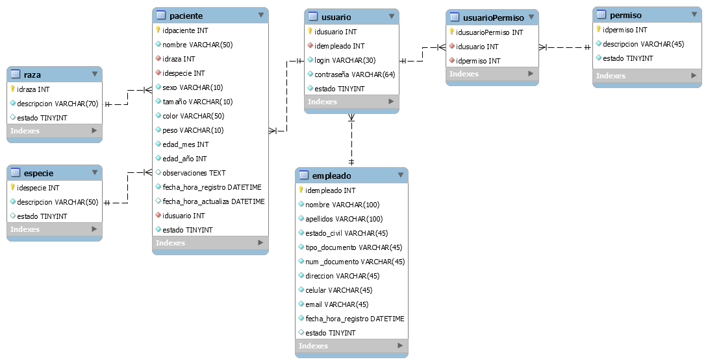

# VeterinariAPP v1

Gestión de veterinaria, registra fotos, ventas, control de inventario, historia clinicas de mascotas, hospedajes, baños y cortes, etc.
Desarrollado en angularJS, mysql, php, bootstrap, html5 y css3.

